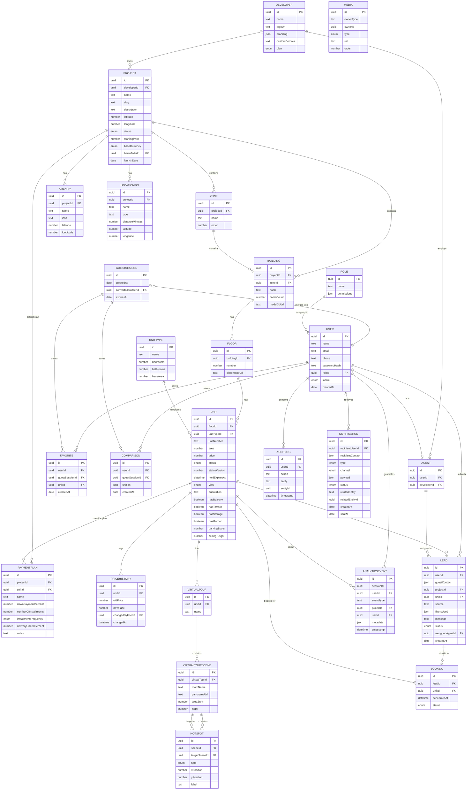

# 03 — Database Schema

> Source: `EstateX_SRS_Backlog_DB_EN_v1_1.md` (Section 8). This is the reference for writing actual migrations. Types are written generically (UUID, text, number, date, Enum, JSON) so this stays independent of any specific database engine (target: PostgreSQL — see [`02-architecture.md`](./02-architecture.md)).

## Core Hierarchical Relationships

- `Developer` ← `Project` ← `Zone/Phase` ← `Building` ← `Floor` ← `Unit`
- `Unit` ← `UnitType` (shared template across similar units)
- `Project` ← `Amenity`, `LocationPOI`, `Media`
- `Unit` ← `VirtualTour` ← `VirtualTourScene` ← `Hotspot`
- `Unit` ← `PaymentPlan`, `PriceHistory`
- `User` **or** `GuestSession` ← `Favorite`, `Comparison`
- `User` ← `Lead`, `Booking`
- `Lead` ← `Agent` (responsible sales rep); `Lead` ← `AnalyticsEvent` (interaction log)
- `User`/`Agent`/`Admin` ← `Notification`

## Entity-Relationship Diagram

---

## 8.2 Core Entities

### User
Users of the system (buyer, investor, agent, admin).

| Field | Type | Description |
|---|---|---|
| id | UUID | Unique identifier |
| name | Text | User name |
| email | Text | Email address |
| phone | Text | Phone number |
| passwordHash | Text | Hashed password (for dashboard users) |
| roleId | UUID (FK → Role) | The functional role |
| locale | Enum (ar/en) | Preferred language |
| createdAt | Date | Account creation date |

### Role / Permission
System roles and their permissions (Super Admin, Admin, Sales Manager, Sales Agent, Content Manager).

| Field | Type | Description |
|---|---|---|
| id | UUID | Unique identifier |
| name | Text | Role name |
| permissions | JSON | List of permissions associated with the role |

### Developer
The real estate developer (the Tenant in the multi-tenant architecture, Phase 4).

| Field | Type | Description |
|---|---|---|
| id | UUID | Unique identifier |
| name | Text | Real estate development company name |
| logoUrl | Text | Company logo |
| branding | JSON | The developer's colors and visual identity |
| customDomain | Text | Custom domain (White-label, Phase 4) |
| plan | Enum | Subscription plan (Phase 4) |

### Project
The main real estate project.

| Field | Type | Description |
|---|---|---|
| id | UUID | Unique identifier |
| developerId | UUID (FK → Developer) | The developer owning the project |
| name | Text | Project name |
| slug | Text | URL text identifier |
| description | Long text | Project description |
| latitude / longitude | Number | Geographic coordinates |
| status | Enum | Under construction / ready / fully sold |
| startingPrice | Number | Displayed starting price |
| baseCurrency | Enum (e.g., EGP/USD) | The primary currency prices are stored/entered in |
| heroMediaId | UUID (FK → Media) | Main image/video |
| launchDate | Date | Project launch date |

### Zone / ProjectPhase
An optional internal subdivision of the project (zone or development phase).

| Field | Type | Description |
|---|---|---|
| id | UUID | Unique identifier |
| projectId | UUID (FK → Project) | The parent project |
| name | Text | Zone/phase name |
| order | Number | Display order |

### Building
A building within the project.

| Field | Type | Description |
|---|---|---|
| id | UUID | Unique identifier |
| projectId / zoneId | UUID (FK) | Link to the project or zone |
| name | Text | Building name/code |
| floorsCount | Number | Number of floors |
| model3dUrl | Text | Link to the building's 3D model |

### Floor
A floor within a building.

| Field | Type | Description |
|---|---|---|
| id | UUID | Unique identifier |
| buildingId | UUID (FK → Building) | The parent building |
| number | Number | Floor number |
| planImageUrl | Text | Floor plan image |

### UnitType
A unit type template (shared across several similar units).

| Field | Type | Description |
|---|---|---|
| id | UUID | Unique identifier |
| name | Text | Type name (apartment / villa / townhouse / penthouse / duplex) |
| bedrooms / bathrooms | Number | Default number of rooms and bathrooms |
| baseArea | Number | Base area in square meters |

### Unit — the pivotal entity in the system

| Field | Type | Description |
|---|---|---|
| id | UUID | Unique identifier |
| floorId | UUID (FK → Floor) | The parent floor |
| unitTypeId | UUID (FK → UnitType) | The unit type |
| unitNumber | Text | Unit number |
| area | Number | Actual area |
| price | Number | Price (in the project's base currency) |
| status | Enum | available / reserved / sold / hidden |
| statusVersion | Number / timestamp | Optimistic-locking token for safe concurrent status updates — see [`02-architecture.md §3`](./02-architecture.md#3-booking-concurrency--consistency) |
| holdExpiresAt | Date and time (nullable) | When set, the unit is temporarily held for a specific agent/Lead until this time |
| view | Enum | garden / pool / sea / city / street |
| orientation | Text | Direction (north/south/east/west) |
| hasBalcony / hasTerrace / hasStorage / hasGarden | Boolean | Additional features |
| parkingSpots | Number | Number of parking spots |
| ceilingHeight | Number | Ceiling height |

---

## 8.3 Content & Media Entities

### Amenity
Facilities within the project (pool, gym, garden, etc.).

| Field | Type | Description |
|---|---|---|
| id | UUID | Unique identifier |
| projectId | UUID (FK → Project) | The parent project |
| name / icon | Text | Name and icon |
| latitude / longitude | Number | Location within the plan (optional) |

### LocationPOI
Geographic points of interest surrounding the project.

| Field | Type | Description |
|---|---|---|
| id | UUID | Unique identifier |
| projectId | UUID (FK → Project) | The parent project |
| name / type | Text | Name and type of point (airport, school, hospital, etc.) |
| distanceMinutes | Number | Estimated time in minutes |
| latitude / longitude | Number | Coordinates |

### Media
Media linked to any entity (project, building, unit) — polymorphic.

| Field | Type | Description |
|---|---|---|
| id | UUID | Unique identifier |
| ownerType / ownerId | Text / UUID | Type and identity of the owning entity |
| type | Enum | image / video / model3d / panorama / floorplan / document |
| url | Text | File link on storage/CDN |
| order | Number | Display order within the gallery |

### VirtualTour
The 360° virtual tour for a specific unit.

| Field | Type | Description |
|---|---|---|
| id | UUID | Unique identifier |
| unitId | UUID (FK → Unit) | The parent unit |
| name | Text | Tour name (e.g., Furnished / Unfurnished) |

### VirtualTourScene
A single panoramic scene (room) within the tour.

| Field | Type | Description |
|---|---|---|
| id | UUID | Unique identifier |
| virtualTourId | UUID (FK → VirtualTour) | The parent tour |
| roomName | Text | Room name (living room, kitchen, bedroom, etc.) |
| panoramaUrl | Text | Link to the 360° image/video |
| areaSqm | Number | Room area (for displaying dimensions, FR-26) |
| order | Number | Scene order within the tour |

### Hotspot
An interactive point within a panoramic scene for navigation or displaying information.

| Field | Type | Description |
|---|---|---|
| id | UUID | Unique identifier |
| sceneId | UUID (FK → VirtualTourScene) | The scene containing the point |
| targetSceneId | UUID (FK → VirtualTourScene, optional) | The scene navigated to when clicked |
| type | Enum | navigation / info / finish-swap |
| xPosition / yPosition | Number | Coordinates of the point within the panoramic scene |
| label | Text | The label shown to the user |

---

## 8.4 Sales & Analytics Entities

### GuestSession
A temporary identity for non-authenticated visitors, allowing Favorites/Comparison before registration.

| Field | Type | Description |
|---|---|---|
| id | UUID | Unique identifier (stored client-side, e.g., cookie/local storage reference) |
| createdAt | Date | Session creation date |
| convertedToUserId | UUID (FK → User, nullable) | Set when the guest later registers, so their data can be merged into the new account |
| expiresAt | Date | Expiry date of the guest session |

### Favorite
Units saved to a user's or guest session's favorites.

| Field | Type | Description |
|---|---|---|
| id | UUID | Unique identifier |
| userId | UUID (FK → User, nullable) | The registered user (nullable if saved by a guest) |
| guestSessionId | UUID (FK → GuestSession, nullable) | The guest session (nullable if saved by a registered user) |
| unitId | UUID (FK → Unit) | The saved unit |
| createdAt | Date | Date added |

*Exactly one of `userId` / `guestSessionId` must be set.*

### Comparison
A saved group of units for comparison.

| Field | Type | Description |
|---|---|---|
| id | UUID | Unique identifier |
| userId | UUID (FK → User, nullable) | The registered user (nullable if created by a guest) |
| guestSessionId | UUID (FK → GuestSession, nullable) | The guest session (nullable if created by a registered user) |
| unitIds | JSON (array) | IDs of the compared units |
| createdAt | Date | Creation date |

### Agent
The sales representative.

| Field | Type | Description |
|---|---|---|
| id | UUID | Unique identifier |
| userId | UUID (FK → User) | The linked user account |
| developerId | UUID (FK → Developer) | The developer they belong to |

### Lead / Inquiry
An interest or contact request from a potential customer.

| Field | Type | Description |
|---|---|---|
| id | UUID | Unique identifier |
| userId / guestContact | UUID / JSON | The registered user or guest data (name, phone, email) |
| projectId / unitId | UUID (FK) | The project/unit of interest |
| source | Text | Source of the request (unit page, comparison, QR, etc.) |
| filtersUsed | JSON | Filters the customer used before the request |
| message | Text | Customer's message (optional) |
| status | Enum | new / contacted / qualified / closed |
| assignedAgentId | UUID (FK → Agent) | The responsible agent |
| createdAt | Date | Creation date |

### Booking
A booking/viewing request linked to a Lead.

| Field | Type | Description |
|---|---|---|
| id | UUID | Unique identifier |
| leadId | UUID (FK → Lead) | The originating request |
| unitId | UUID (FK → Unit) | The unit |
| scheduledAt | Date and time | Viewing/booking appointment |
| status | Enum | pending / confirmed / completed / cancelled |

### AnalyticsEvent
A log of every user interaction for analytics and sales intelligence purposes.

| Field | Type | Description |
|---|---|---|
| id | UUID | Unique identifier |
| sessionId / userId | UUID | The session/user |
| eventType | Text | Event type (view_unit, apply_filter, add_favorite, etc.) |
| projectId / unitId | UUID (FK, optional) | The entity linked to the event |
| metadata | JSON | Additional data about the event |
| timestamp | Date and time | Time the event occurred |

### AuditLog
An audit log for dashboard changes (Phase 4), and unit status transitions from Phase 1 onward.

| Field | Type | Description |
|---|---|---|
| id | UUID | Unique identifier |
| userId | UUID (FK → User) | Who made the change |
| action | Text | Type of operation (create/update/delete) |
| entity / entityId | Text / UUID | The affected entity |
| timestamp | Date and time | Time of the operation |

---

## 8.5 Payment Entities

### PaymentPlan
A payment/installment plan template attachable to a project (default) or an individual unit (override).

| Field | Type | Description |
|---|---|---|
| id | UUID | Unique identifier |
| projectId | UUID (FK → Project, nullable) | Applies to all units of the project by default |
| unitId | UUID (FK → Unit, nullable) | Overrides the project-level plan for this specific unit |
| name | Text | Plan name (e.g., "5 Years Equal Installments") |
| downPaymentPercent | Number | Required down payment as a percentage of price |
| numberOfInstallments | Number | Total number of installments |
| installmentFrequency | Enum | monthly / quarterly / semi-annual / annual |
| deliveryLinkedPercent | Number (nullable) | Portion of the price due on delivery, if applicable |
| notes | Text | Additional terms |

*Exactly one of `projectId` / `unitId` should typically be set; a unit-level plan takes precedence over the project-level default.*

### PriceHistory
A log of price changes for a unit, powering FR-17a / FR-56.

| Field | Type | Description |
|---|---|---|
| id | UUID | Unique identifier |
| unitId | UUID (FK → Unit) | The unit whose price changed |
| oldPrice / newPrice | Number | Price before and after the change |
| changedByUserId | UUID (FK → User) | Who made the change |
| changedAt | Date and time | When the change occurred |

---

## 8.6 Notification Entity

### Notification
An individual notification dispatched to a user (agent, admin, or customer) across one or more channels.

| Field | Type | Description |
|---|---|---|
| id | UUID | Unique identifier |
| recipientUserId | UUID (FK → User, nullable) | The recipient, if a registered user |
| recipientContact | JSON (nullable) | Contact info for non-registered recipients (e.g., guest customer email/phone) |
| type | Enum | new_lead / status_change / import_result / booking_confirmation / favorite_update / other |
| channel | Enum | in_app / email / sms / whatsapp / push |
| payload | JSON | Message content / template variables |
| status | Enum | pending / sent / failed |
| relatedEntity / relatedEntityId | Text / UUID | The entity that triggered the notification (e.g., Lead, Unit) |
| createdAt / sentAt | Date and time | Timestamps for creation and delivery |

---

## Related Documents

- [`02-architecture.md`](./02-architecture.md) — the concurrency strategy behind `Unit.statusVersion` / `Unit.holdExpiresAt`
- [`04-api-spec.md`](./04-api-spec.md) — endpoints exposing these entities
